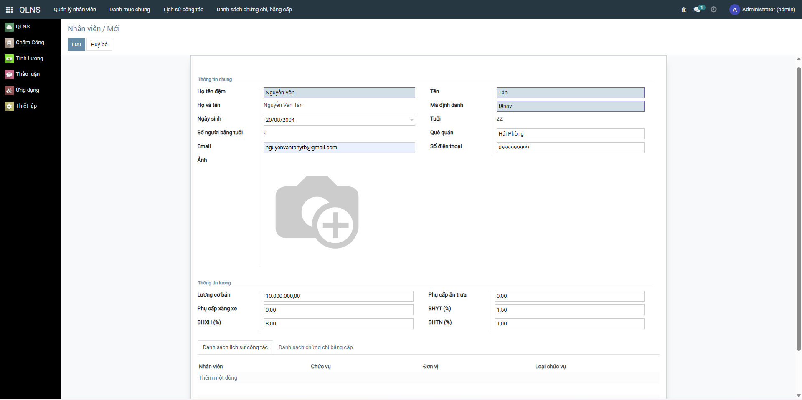
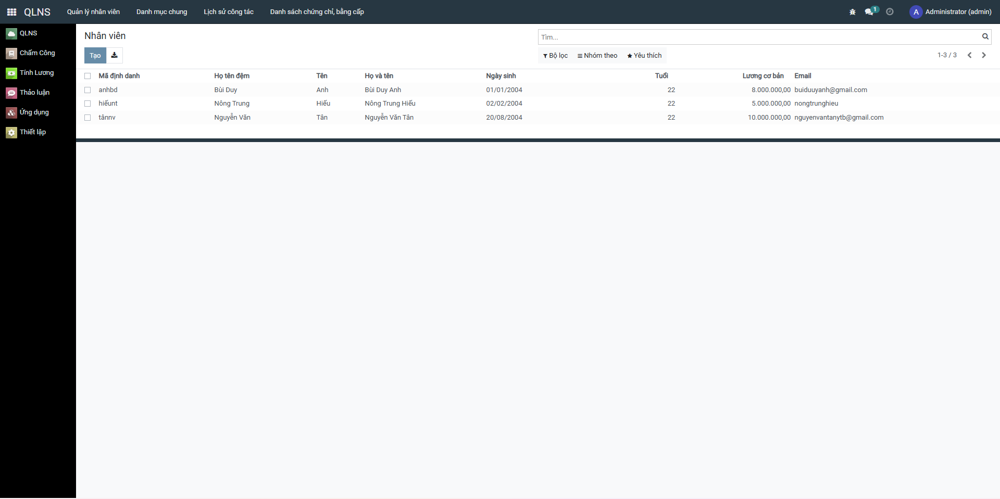
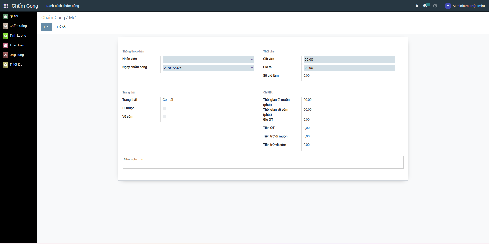
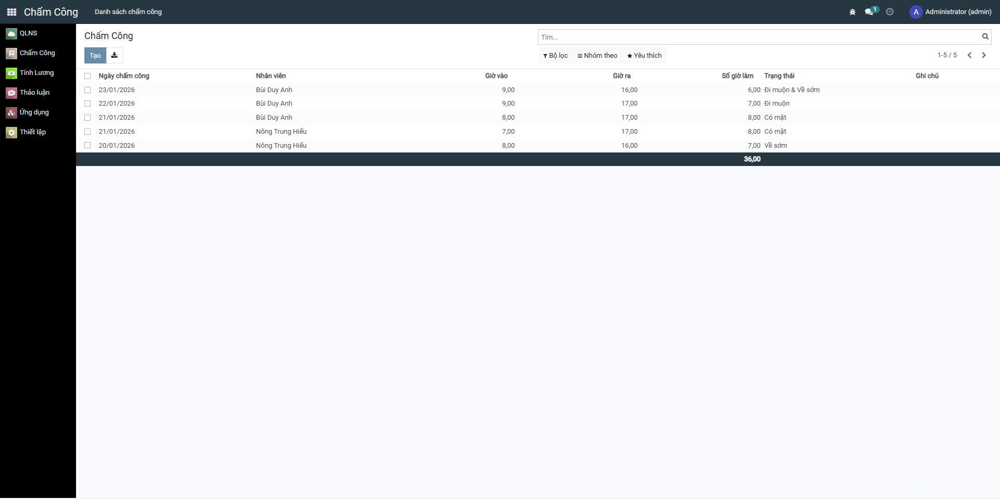
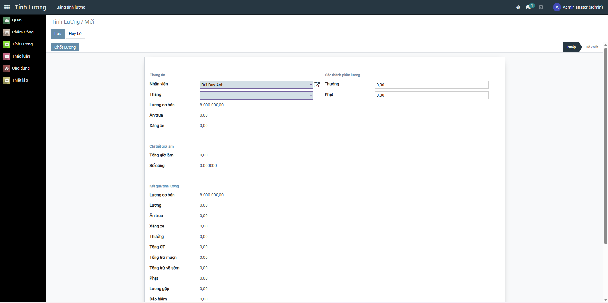
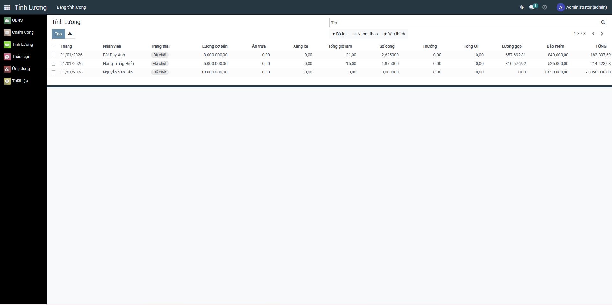
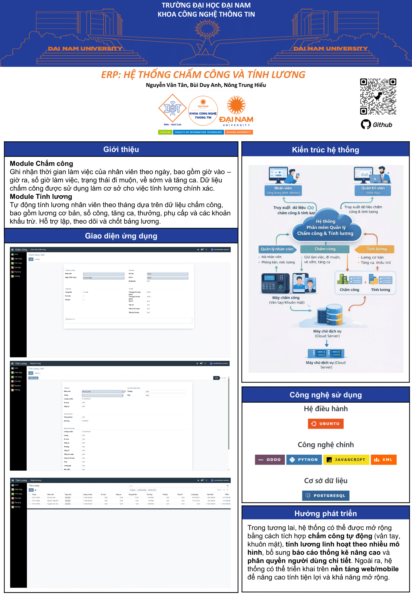

<h2 align="center">
    <a href="https://dainam.edu.vn/vi/khoa-cong-nghe-thong-tin">
    🎓 Faculty of Information Technology (DaiNam University)
    </a>
</h2>
<h2 align="center">
    PLATFORM ERP – BUSINESS INTERNSHIP
</h2>
<div align="center">
    <p align="center">
        
        
        
    </p>

[](https://www.facebook.com/DNUAIoTLab)
[](https://dainam.edu.vn/vi/khoa-cong-nghe-thong-tin)
[](https://dainam.edu.vn)

</div>

---

## 📖 1. Giới thiệu

**Platform ERP – Business Internship** là hệ thống ERP phục vụ cho học phần *Thực tập doanh nghiệp* tại Khoa Công nghệ Thông tin – Trường Đại học Đại Nam, được phát triển dựa trên mã nguồn mở **Odoo**.

Repository này **fork và kế thừa** từ dự án gốc:

* 🔗 https://github.com/FIT-DNU/Business-Internship

Repository GitHub cá nhân:

* 🔗 https://github.com/nvtan208/TTDN-16-02-N10

Trên nền tảng đó, nhóm thực hiện đã **mở rộng và phát triển thêm các module nghiệp vụ**, tiêu biểu là:

* 📌 Module Chấm công  
* 📌 Module Tính lương  

Mục tiêu của repository này là phục vụ mục đích **học tập, nghiên cứu, thực hành triển khai Odoo**, cũng như làm tài liệu tham khảo cho sinh viên trong quá trình thực tập và làm đồ án.

---

## ✨ 2. Các chức năng mở rộng

### 🕒 Module Chấm công
- Quản lý thông tin nhân viên
- Ghi nhận thời gian vào/ra
- Theo dõi ngày công, giờ làm việc
- Tổng hợp dữ liệu chấm công theo tháng

### 💰 Module Tính lương
- Tính lương dựa trên dữ liệu chấm công
- Hỗ trợ các khoản phụ cấp, khấu trừ
- Quản lý bảng lương theo kỳ
- Xuất báo cáo lương cho nhân viên

---

## 🔧 3. Công nghệ sử dụng

- Odoo, Python, JavaScript, XML
- PostgreSQL
- Ubuntu

---

## ⚙️ 4. Cài đặt hệ thống

```bash
git clone https://github.com/nvtan208/TTDN-16-02-N10.git
```

---

## 📝 5. Hình ảnh các chức năng của hệ thống

### 👥 Module Quản lý nhân sự



### 🕒 Module Chấm công



### 💰 Module Tính lương



---

## 🖼️ 6. Poster hệ thống

<p align="center">
  
</p>

---

✨ Developed & extended for learning and internship purposes.
